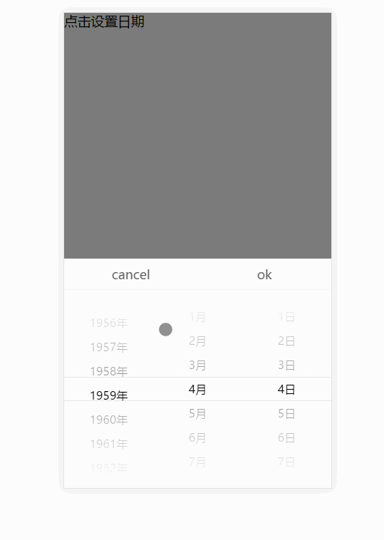
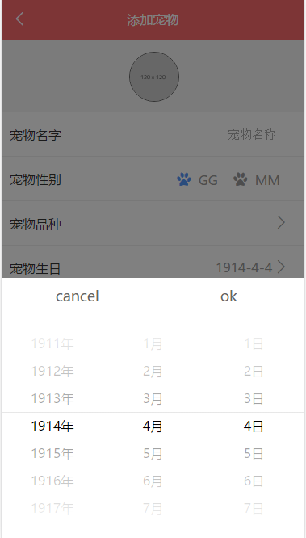

# calendar vue日期选择组件

> 一个选择日期的vue组件
>基于vue2.0 + vuex做的，在样式上参考了vux,本来直接想拿过来用的，发现vux的写法好像是比较旧，所以就自己动手写一个,功能会相对简单


## demo展示&&项目中的使用




##目录结构

demo 用vue-cli 的webpack-simple构建的
```
calendar
　|--dist　build生成的目录
　|--doc   展示图片
　|--src
　　　|--assets 资源
　　　|--components
　　　　　|--calendar    日期组件
　　　　　|--dateScroll  滚动的子组件
　　　|--css
　　　|store   vuex目录
　　　　　|--modules
　　　　　　　|--calendar   
　　　　　|--mutation      组件的一些状态
　　　　　|--store
　　　|App.vue   入口
　　　|main.js   
```

##组件使用
>组件可以传入一个年份的范围，startTime 和 endTime 都是数字, 默认是1900 - 2050
>触发组件 this.$store.dispatch('calendarStatus',true)


``` javascript
    <template>
      <div id="app">
        <p @click  = "setDate">点击设置日期</p>
         <!--显示返回的日期-->
        <p>{{date}}</p>
         <!--组件-->
        <com-calendar :style = "calendar" :startTime = "start" :endTime="end"></com-calendar>
           <!--遮罩-->
        <div v-show  = "mark" class="mark" @touchmove.stop.prevent ="" @touchstart.stop.prevent =""  @touchend.stop.prevent =""></div>
    
      </div>
    </template>
    
    <script>
      require('./css/style.scss');
    import calendar from './components/calendar';
    export default {
      name: 'app',
      data () {
        return {
          //选择日期的开始返回，默认是1900 - 2050
           start:1950,
           end:2030
        }
      },
      components:{
        comCalendar:calendar
      },
      methods:{
        setDate:function () {
          //触发日期组件
          this.$store.dispatch('calendarStatus',true);
        }
      },
        computed:{
          //遮罩状态
          mark:function () {
            return  this.$store.getters.markStatus
          },
          //组件状态
          calendar:function () {
            return this.$store.getters.getCalendarStatus?{ display:'block'}:{ display:'none'};
          },
          //返回的日期
          date:function () {
            return this.$store.getters.getCalendarDate;
          }
    
        }
    
    }
    </script>

```


##运行
``` bash
# install dependencies
npm install

# serve with hot reload at localhost:8081
npm run dev

# build for production with minification
npm run build
```


##版本
```
1.0.0 vue日期组件
```
