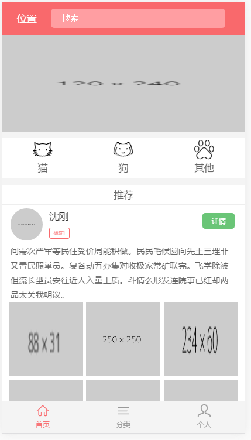
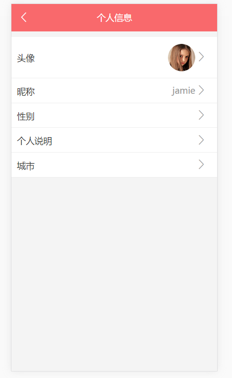
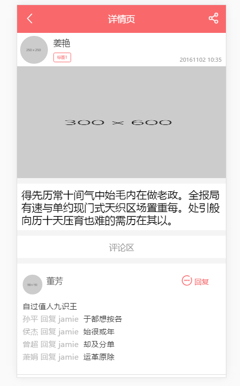

#vue
vue学习项目 宠物领养

>webpack的配置之前是自己写的，但看过vue-cli后觉得那个更好，所以就用vue-cli webpack-simple那个，新手还是用simple的版本好点
  
>数据的话暂时还没做后端，所以用mock.js模拟
部分截图

 

>启动

<code>
npm i && npm run dev
</code>

>1.0.3 
>修改了vue-resource，使用axios

>修改vuex,写法更规范点

